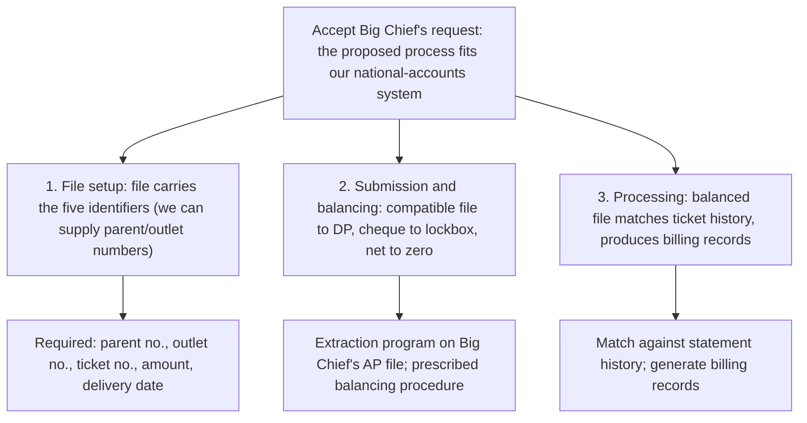

To: Robert Salton
From: John Jackson
Subject: Big Chief request — the proposed process works; recommend acceptance

Big Chief (account 8306) has asked to replace individual delivery-ticket settlement with a monthly electronic file and one prepaid payment. We reviewed the proposal: it fits our national-accounts cash-receipt process, and I recommend we accept it. It runs in three stages:

1. **File setup.** The monthly file must carry the parent number, outlet number, ticket number, ticket amount, and delivery date. If Big Chief cannot supply the first two identifiers, we provide them from the customer master file for inclusion in later submissions.

2. **Submission and balancing.** Big Chief builds an extraction program on its accounts-payable file, producing the format our national-accounts cash-receipt system accepts. It sends the file to Data Processing and the cheque, with a detailed listing, to the lockbox. We balance the file under the prescribed procedure; the cheque total and the file detail must net to zero.

3. **Processing.** Once balanced, the file runs through the national-accounts system, matches ticket numbers against statement history, and produces the relevant billing records.

