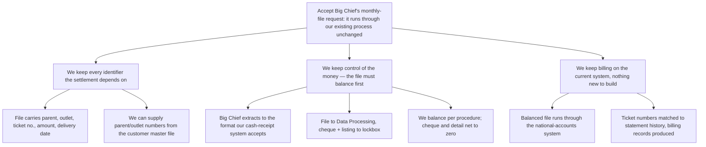

**To:** Robert Salton
**From:** John Jackson
**Subject:** We can accept Big Chief's monthly-file request without changing our systems

Big Chief (account 8306) asks to stop settling delivery tickets individually and instead send us one monthly computer file with a single prepaid payment. We reviewed how that would work end to end.

We recommend accepting: the arrangement runs through our existing national-accounts process unchanged. The source review covers feasibility only — it does not establish what the change is worth to us in cost or service, so the commercial case still needs to be made separately.

**1. We keep every identifier the settlement process depends on.**
- The file must carry parent number, outlet number, ticket number, ticket amount and delivery date.
- If Big Chief cannot supply the parent and outlet numbers, we can feed them from our customer master file for use in later submissions.

**2. We keep control of the money, because the file must balance before anything moves.**
- Big Chief builds the extraction program against its accounts-payable file, in the format our national-accounts cash-receipt system already accepts.
- The file goes to Data Processing; the cheque and detailed listing go to the lockbox.
- We balance the file under the prescribed procedure, and the cheque total and file detail must net to zero.

**3. We keep billing on the current system, with no new processing to build.**
- Once balanced, the monthly file runs through the national-accounts system.
- It matches ticket numbers against statement history and produces the relevant billing records.

**What I need:** your approval to proceed with Big Chief on this basis. `[data needed: cost/benefit of the change]`

*Order: ranking — data integrity first, then financial control, then processing.*

Structurally: the memo now opens with the decision instead of a findings list, and the three mechanical steps have been recast as what management retains, with the original procedure detail demoted underneath them.
