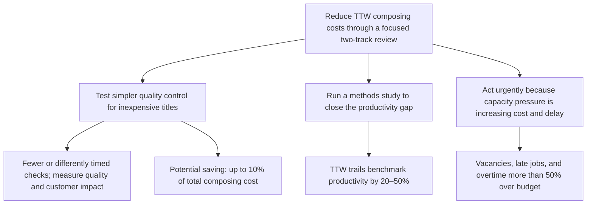

# Reduce TTW composing costs through a focused two-track review

Composition is TTW’s largest production cost, and TTW is uncompetitive on simple work. Yet managers do not know whether total composing costs are excessive or which changes will reduce them without harming quality.

TTW should immediately test a simpler process for suitable low-cost titles and run a methods study to close its productivity gap.

1. **Simplify quality control for inexpensive titles.**  
   Selected jobs should test fewer or differently timed checks, with quality and customer impact measured. This could save up to 10% of total composing cost.

2. **Improve the composing method.**  
   A separate methods study should identify the causes of TTW’s 20–50% productivity gap versus benchmark performance and the changes needed to close it.

3. **Address the capacity pressure while the review proceeds.**  
   Manual composition is short of capacity; TTW has lost two employees, struggles to hire and retain compositors because pay is below the local market, runs most jobs late, and is spending more than 50% above its overtime budget. These constraints make a productivity improvement urgent.

Kennedy is willing to test which stages can be removed and why productivity trails the benchmark. Managers may disagree on the scale of the cost problem, but they agree to investigate.

**Omitted or demoted:** interview names and the proposed comparisons with three other printers were omitted because they do not directly support the recommended work; comparisons may be used as supporting context within the methods study.

