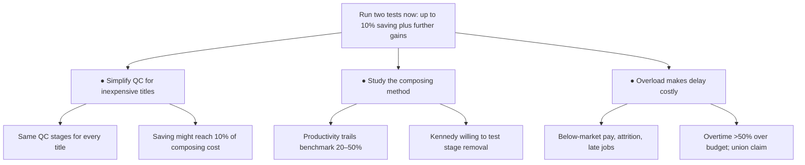

```text
To:      Engagement Manager
From:    Junior Consultant
Subject: Composing costs can be cut — two tests to run now

Composition is our largest production cost — roughly 40% of a hardback and
50–55% of a paperback — and we are losing simple work to competitors without
knowing whether our composing costs are genuinely excessive. I spent the past
two weeks in the composing room to find out. Can we cut composing cost without
harming quality? Yes: two tests, costing little, should confirm savings of up
to 10% of total composing cost and point to further gains.

1. Simplify the process for inexpensive titles.
   Every title — a complex reference book or a simple novel — passes through
   essentially the same quality-control stages. That uniformity is where the
   excess cost sits. Test selected simple jobs with fewer or differently timed
   checks, and measure the effect on quality and on customers. The saving
   might reach 10% of total composing cost.

2. Study the composing method.
   Measured productivity trails the industry benchmark by 20–50%. A separate
   methods study could locate the gap and identify further improvements.
   George Kennedy is willing to run the test of which stages can be removed.

Why act now: the department is overloaded and getting more expensive.
   Manual composition is critically short of capacity. We pay below local
   market rates, cannot hire or retain compositors, have just lost two
   employees, and run most jobs late. Overtime is more than 50% over budget,
   and the union is pressing a new claim. Every month of delay compounds the
   cost these two tests are designed to remove.

Optional context: comparisons with three other printers might add useful
background, although I doubt a simple comparison will settle whether our
costs are excessive — the two tests above will.

Next step: your go-ahead to set up the two tests with Kennedy.
```



Order: actions ranked by size of provable payoff, then urgency.

Omitted: the record-of-work framing ("this note records the information gathered"), the interviewee list beyond Kennedy (only he carries an action), "people in Aylesbury want to understand the causes", and the managers' disagreement about whether costs are high — it settles nothing, and their stated willingness to investigate is captured by Kennedy's commitment. No facts were dropped that change the recommendation; supporting detail was demoted, not deleted.
