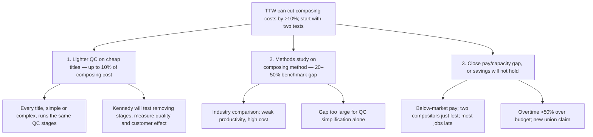

**To:** Engagement Manager
**From:** [consultant]
**Subject:** TTW can cut composing costs by at least 10%, and we should start with two tests in Aylesbury

Composition is the largest production cost at TTW — around 40% of hardback and 50–55% of paperback cost — and TTW is uncompetitive on simple work without knowing whether its composing costs are genuinely excessive. Two weeks in Aylesbury now show that they are, and that the two largest sources of saving can be tested cheaply. George Kennedy is willing to run both tests, and management, though divided on whether costs are high, is willing to investigate.

I recommend three actions, largest prize first.

**1. Test a lighter quality-control process on inexpensive titles — worth up to 10% of total composing cost.**
Every title passes essentially the same quality-control stages, whether it is a complex reference book or a simple novel. Select a set of cheap jobs, remove or re-time checks, and measure the effect on quality and on customers. Kennedy has agreed to test whether stages can be removed. This is the one saving we can size today: roughly 10% of composing cost.

**2. Commission a methods study on the composing method itself — TTW trails the benchmark by 20–50%.**
Industry comparisons show weak productivity and high cost. The gap is far larger than process simplification alone can explain, so the method, not just the checks, is in question. A methods study establishes how much of the 20–50% is recoverable and at what capital cost. [data needed: cost and duration of a methods study]

**3. Close the pay and capacity gap now, or the first two savings will not survive the year.**
The department is overloaded, manual composition worst of all. TTW pays below local market rates, cannot hire or retain compositors, has just lost two employees, and now runs most jobs late. Overtime is over budget by more than 50% and the union is pressing a new claim. Every one of these costs shows up inside the composing figure we are trying to reduce, and a department losing people cannot absorb a process trial. Settle the pay position before the tests begin.

**What I need from you:** approval to start the quality-control test with Kennedy, and a decision on funding the methods study.

**Omitted or demoted:** the proposed comparison with three other printers (the note itself doubts it would settle the question, and it produces no saving); the list of people interviewed and management's disagreement about whether costs are high, both compressed into one clause of the intro, since neither supports a recommendation; the framing sentence "this note records the information gathered."

**What changed structurally:** the note now opens with the answer and asks for a decision, and the department's overload — previously an observation buried mid-text — becomes the third recommended action, since it determines whether the other two savings hold.
