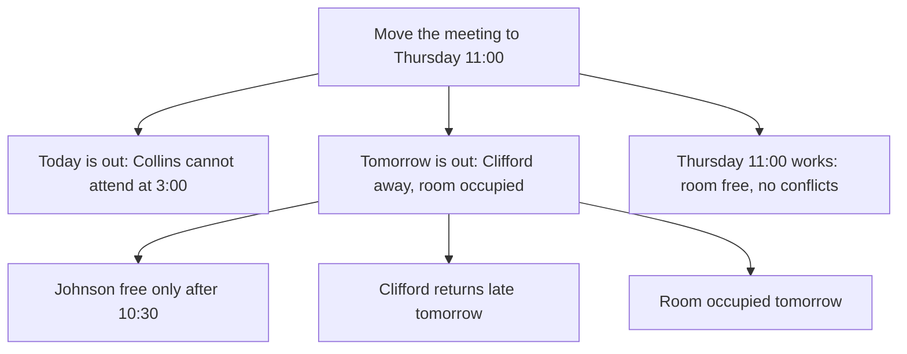

**Subject: Move today's 3:00 meeting to Thursday 11:00 — OK?**

Collins cannot attend today's 3:00 meeting, so we need a new slot. I propose Thursday at 11:00 — please confirm.

Why Thursday at 11:00:

1. **Today is out** — Collins cannot attend at 3:00.
2. **Tomorrow is out** — Johnson could meet after 10:30, but Clifford will not return from Frankfurt until late tomorrow, and the conference room is occupied all day.
3. **Thursday 11:00 works** — the conference room is free and no one has raised a conflict.

