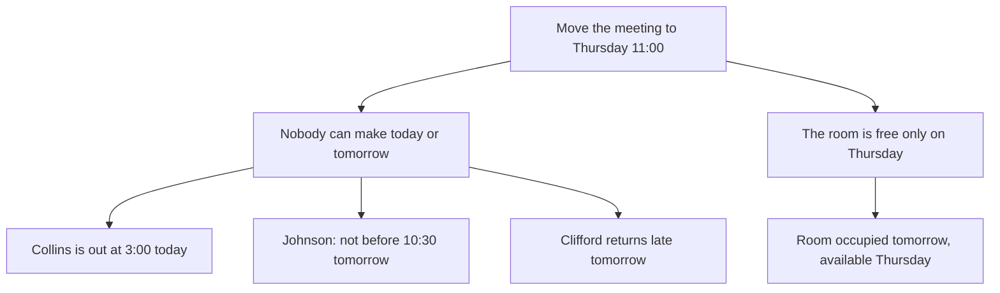

**Subject: Move today's meeting to Thursday at 11:00 — OK?**

Can we shift today's 3:00 meeting to Thursday at 11:00? It is the earliest slot that works for everyone:

1. Collins, Johnson and Clifford cannot all make today or tomorrow — Collins is out at 3:00, Johnson is free no earlier than 10:30 tomorrow, and Clifford is back from Frankfurt only late tomorrow.
2. The conference room is taken tomorrow and free on Thursday.

If Thursday at 11:00 works for you, I'll send the invitation.

