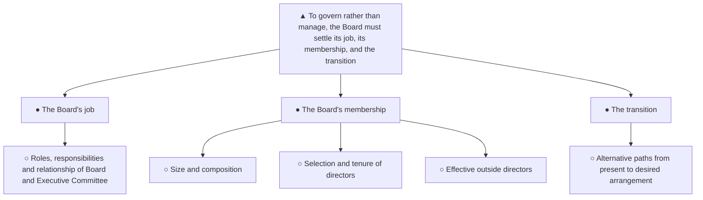

In October we handed divisional managers full authority for day-to-day operations, reserving policy and planning to the Board. Yet for years this Board has spent its time on exactly the short-term operational problems we have now delegated — the role we kept for ourselves is the one we have never defined or staffed for. If the Board is to govern rather than manage, what must it settle? Three things: what its job is, who should do it, and how to move from the present arrangement to that one.

**1. The Board's job.** Define the respective roles and responsibilities of the Board and the Executive Committee and the relationship between them, so that policy and planning are actually owned at Board level.

**2. The Board's membership.** Decide the optimum size and composition, the principles for selecting directors and setting their tenure, and how to make an outside director an effective participant.

**3. The transition.** Choose among the alternative ways of moving from the present Board and Executive Committee arrangement to the desired one.

