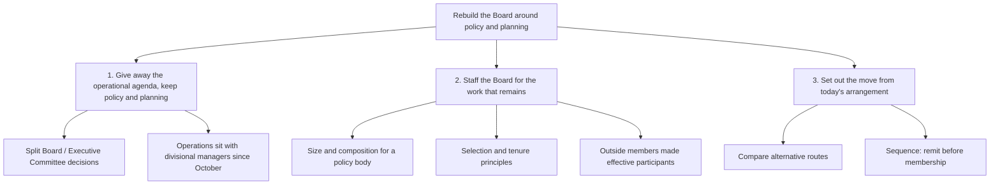

# The Board's role after the October reorganization

Since October, divisional managers have held full authority for day-to-day operations; policy and planning remain ours. In practice we still spend our time on short-term operational problems, and the arrangements we inherited — our size, our membership, our split of work with the Executive Committee — were built for the Board we used to be.

So the question is not what topics deserve discussion. It is what we change so that the Board does the work the reorganization left to it.

**We should rebuild the Board around policy and planning: draw a hard line between our work and the Executive Committee's, staff the Board to do that work, and set out how we get there from today's arrangement.**

## 1. Give the operational agenda away and keep policy and planning

- Define what the Board decides and what the Executive Committee decides, so that the same matter does not reach both.
- Refuse the short-term operational items that divisional managers now own outright.
- State the responsibilities of each body and how the two relate day to day.

## 2. Staff the Board for the work that remains

- Set the size that suits a policy and planning body rather than an operating one.
- Fix the composition that goes with it, inside and outside members.
- Adopt principles for selecting directors and for their tenure, so composition holds over time rather than drifting with each appointment.
- Make outside members effective participants — their contribution is what policy work most needs and what an operational agenda most easily wastes.

## 3. Set out the move from the present arrangement to the intended one

- Compare the alternative routes from today's Board and Executive Committee arrangement to the one we choose.
- Say what changes first, so the operational agenda leaves the Board before the membership changes rather than after.

*[data needed: the current split of Board agenda time between operational and policy items, to show the size of the gap we are closing.]*

**What I need from the Board:** agreement that these three are the questions before us, and that we settle 1 before 2.

**What changed structurally:** the list of discussion topics became an answer with three same-kind actions under it; composition, selection and tenure merged into one branch because they are one decision about staffing, and the transition — buried as item 5 — became a first-level branch. Order is now sequential-by-dependency: remit determines membership, membership determines the route.
