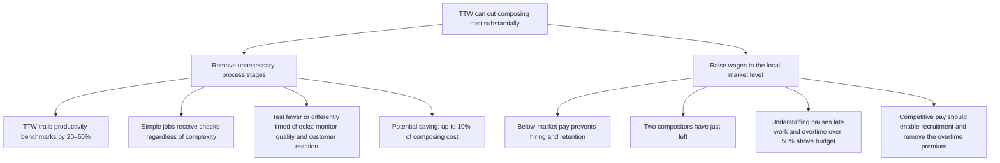

```mermaid
flowchart TD
    A["TTW can cut composing cost substantially"] --> B1["Remove unnecessary process stages"]
    A --> B2["Raise wages to the local market level"]

    B1 --> C11["TTW trails productivity benchmarks by 20–50%"]
    B1 --> C12["Simple jobs receive checks regardless of complexity"]
    B1 --> C13["Test fewer or differently timed checks; monitor quality and customer reaction"]
    B1 --> C14["Potential saving: up to 10% of composing cost"]

    B2 --> C21["Below-market pay prevents hiring and retention"]
    B2 --> C22["Two compositors have just left"]
    B2 --> C23["Understaffing causes late work and overtime over 50% above budget"]
    B2 --> C24["Competitive pay should enable recruitment and remove the overtime premium"]
```