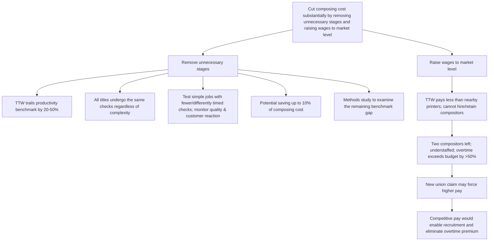

```mermaid
flowchart TD
    A["Cut composing cost substantially by removing unnecessary stages and raising wages to market level"] --> B1["Remove unnecessary stages"]
    A --> B2["Raise wages to market level"]
    
    B1 --> C11["TTW trails productivity benchmark by 20‑50%"]
    B1 --> C12["All titles undergo the same checks regardless of complexity"]
    B1 --> C13["Test simple jobs with fewer/differently timed checks; monitor quality & customer reaction"]
    B1 --> C14["Potential saving up to 10% of composing cost"]
    B1 --> C15["Methods study to examine the remaining benchmark gap"]
    
    B2 --> D21["TTW pays less than nearby printers; cannot hire/retain compositors"]
    D21 --> D22["Two compositors left; understaffed; overtime exceeds budget by >50%"]
    D22 --> D23["New union claim may force higher pay"]
    D23 --> D24["Competitive pay would enable recruitment and eliminate overtime premium"]
```
