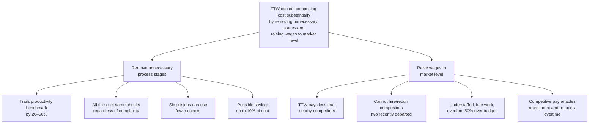

```mermaid
flowchart TD
    Top["TTW can cut composing cost substantially<br/>by removing unnecessary stages and<br/>raising wages to market level"]
    
    Top --> B1["Remove unnecessary<br/>process stages"]
    Top --> B2["Raise wages to<br/>market level"]
    
    B1 --> S1["Trails productivity benchmark<br/>by 20–50%"]
    B1 --> S2["All titles get same checks<br/>regardless of complexity"]
    B1 --> S3["Simple jobs can use<br/>fewer checks"]
    B1 --> S4["Possible saving:<br/>up to 10% of cost"]
    
    B2 --> S5["TTW pays less than<br/>nearby competitors"]
    B2 --> S6["Cannot hire/retain compositors<br/>two recently departed"]
    B2 --> S7["Understaffed, late work,<br/>overtime 50% over budget"]
    B2 --> S8["Competitive pay enables<br/>recruitment and reduces overtime"]
```
