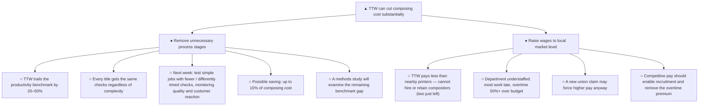
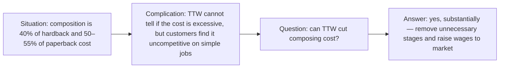

```mermaid
flowchart TD
    A["▲ TTW can cut composing cost substantially"]
    A --> B1["● Remove unnecessary process stages"]
    A --> B2["● Raise wages to local market level"]

    B1 --> C11["○ TTW trails the productivity benchmark by 20–50%"]
    B1 --> C12["○ Every title gets the same checks regardless of complexity"]
    B1 --> C13["○ Next week: test simple jobs with fewer / differently timed checks, monitoring quality and customer reaction"]
    B1 --> C14["○ Possible saving: up to 10% of composing cost"]
    B1 --> C15["○ A methods study will examine the remaining benchmark gap"]

    B2 --> C21["○ TTW pays less than nearby printers — cannot hire or retain compositors (two just left)"]
    B2 --> C22["○ Department understaffed: most work late, overtime 50%+ over budget"]
    B2 --> C23["○ A new union claim may force higher pay anyway"]
    B2 --> C24["○ Competitive pay should enable recruitment and remove the overtime premium"]
```

```mermaid
flowchart LR
    S["Situation: composition is 40% of hardback and 50–55% of paperback cost"] --> C["Complication: TTW cannot tell if the cost is excessive, but customers find it uncompetitive on simple jobs"]
    C --> Q["Question: can TTW cut composing cost?"]
    Q --> A["Answer: yes, substantially — remove unnecessary stages and raise wages to market"]
```
