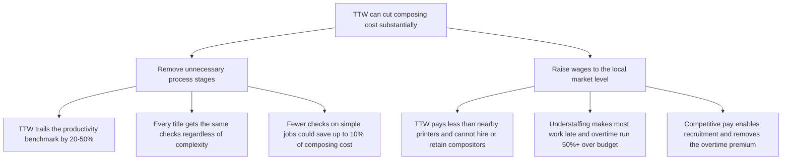
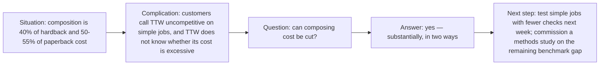

▲ **TTW can cut composing cost substantially — by removing unnecessary process stages and paying market wages**

**Order:** ranking — the stage removal carries the quantified saving (up to 10%) and is tested first; the wage action follows.
