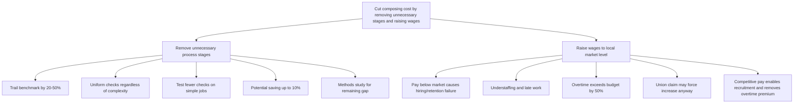

| Marker | Meaning |
|---|---|
| `▲` | top / answer |
| `●` | first-level group |
| `○` | supporting detail |
| `⚠` | violation (mixed kinds, unexplainable order, false grouping) |
| `↑` | conclusion buried lower than it belongs — promote it |
| `⇄` | wrong order type here |
| `⊗` | overlap (ME broken) |
| `⊕` | gap (CE broken) |
| `✂` | cut, or move to an appendix |

### Annotated Text

⚠ Subject: TTW composing cost

During the past two weeks I reviewed the Aylesbury composing room. Composition represents about 40% of hardback cost and 50-55% of paperback cost. TTW does not know whether the cost is excessive, but customers regard it as uncompetitive on simple jobs.

▲ Our preliminary work indicates that TTW can cut composing cost substantially by:

- ● removing unnecessary process stages;
- ● raising wages to the local market level.

● REMOVE UNNECESSARY STAGES

○ TTW trails the productivity benchmark by 20-50%.
○ Every title passes essentially the same checks regardless of complexity.
○ Next week, selected simple jobs will be tested with fewer or differently timed checks, while quality and customer reaction are monitored.
○ The possible saving is up to 10% of composing cost.
○ A methods study will examine the remaining benchmark gap.

⇄ ● RAISE WAGES

○ TTW pays less than nearby printers and cannot hire or retain enough compositors.
○ Two have just left. The department is understaffed, most work is late, and overtime exceeds budget by more than 50%.
○ A new union claim may force higher pay; competitive pay should make recruitment possible and remove the overtime premium.

### Pyramid

### Gap Table

| Status | Location | Issue |
|---|---|---|
| OK | Structure | No significant gaps detected; arguments are supported by facts. |
