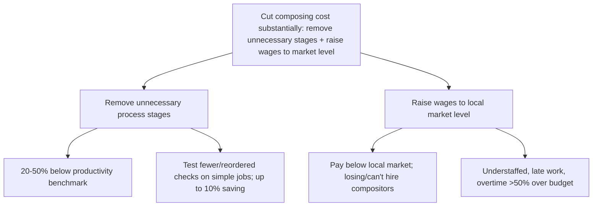
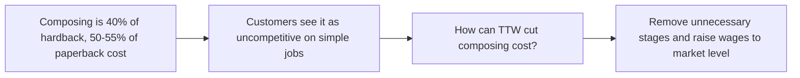

```
Legend: ▲ top · ● first-level group · ○ support
```

▲ TTW can substantially cut composing cost by removing unnecessary process stages and raising wages to market level

● Remove unnecessary process stages
  ○ TTW trails the productivity benchmark by 20–50%
  ○ Every title goes through the same checks regardless of complexity
  ○ Test fewer/differently-timed checks on selected simple jobs next week, monitoring quality and customer reaction
  ○ Possible saving: up to 10% of composing cost
  ○ Methods study to examine the remaining benchmark gap

● Raise wages to local market level
  ○ TTW pays less than nearby printers
  ○ Two compositors have just left; department is understaffed
  ○ Most work is late; overtime exceeds budget by more than 50%
  ○ A new union claim may force higher pay
  ○ Competitive pay should enable recruitment and remove the overtime premium




