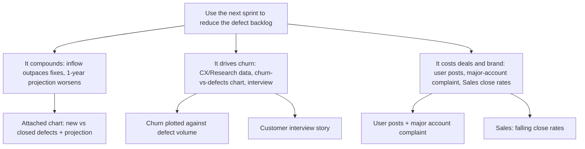

Subject: Next sprint should go to the defect backlog — it's costing us growth, customers, and deals

Hi Alex,

The defect backlog is still growing, and the attached chart makes it structural, not seasonal: new defects consistently outnumber the ones we close, and the one-year projection shows the gap widening. So the question for the next sprint is whether we keep absorbing this or pay it down — I recommend we spend the sprint reducing the backlog. Three reasons:

1. **The backlog compounds if we don't act.** The inflow/outflow chart and its one-year projection show the queue growing on its own; every sprint we defer makes the eventual fix bigger.
2. **Defects are driving churn.** Customer Experience and Research both report defects contributing to churn; the churn-vs-defect-volume chart and a customer interview show the same link from two independent angles.
3. **It's now costing us revenue and reputation.** User posts and a direct complaint from a major account point to brand damage, and Sales reports these concerns are making deals harder to close.

Can I count the defect backlog as the next sprint's focus? Happy to walk through the charts if useful.

