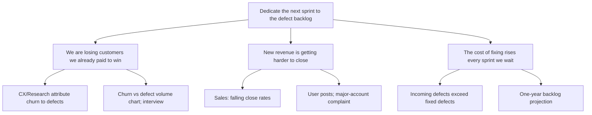

Subject: Let's spend the next sprint on the defect backlog

Hi Alex,

We close fewer defects each sprint than come in. On current rates the attached projection puts the backlog a year out at a level we cannot work off later, and the cost of leaving it is already landing on revenue. I'd like the next sprint dedicated to reducing the defect backlog.

Three reasons, strongest first:

1. **We are losing customers we already paid to win.** Customer Experience and Research attribute churn to defects; the second chart tracks churn against defect volume, and the interview shows how it plays out for one account.
2. **New revenue is getting harder to close.** Sales reports defect concerns slowing deals, backed by public user posts and a written complaint from a major account.
3. **The cost of fixing rises every sprint we wait.** Incoming defects outpace fixed ones today, so one sprint of focus now buys back capacity that a later cleanup would cost several sprints.

What I need: your decision on the next sprint's focus by the planning meeting. If a full sprint is too much, tell me and I'll come back with a partial-capacity version.

—

What changed structurally: the recommendation moved from the last line to the first, and the three charts-and-reports paragraphs were recast from things we observed into what Alex loses by waiting, ordered by size of loss.
