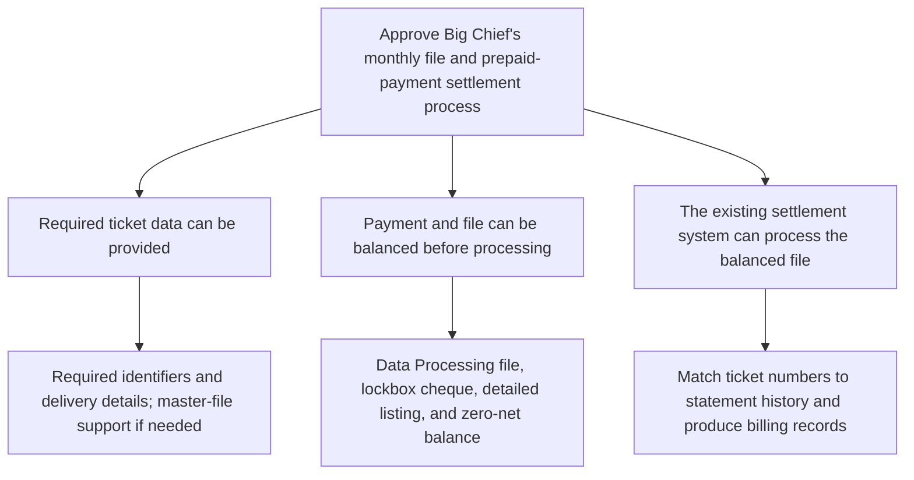

**To:** Robert Salton  
**From:** John Jackson  
**Subject:** Approve Big Chief’s monthly file and prepaid-payment settlement process

Big Chief requests to replace individual delivery-ticket settlement with a monthly computer file and one prepaid payment. The proposed process can be handled through the national-accounts settlement process, provided the required controls are followed.

Approve the proposal because:

1. **The required delivery-ticket data can be provided.**  
   The file will include the parent number, outlet number, ticket number, amount, and delivery date. If Big Chief cannot provide the parent and outlet numbers initially, we can supply them from the customer master file for later submissions.

2. **The payment and file can be controlled before processing.**  
   Big Chief will send its accounts-payable extract to Data Processing and its cheque, with detailed listing, to the lockbox. We will balance the file under the prescribed procedure; the cheque total and file detail must net to zero.

3. **The balanced file can be processed through the existing settlement system.**  
   The national-accounts system will match ticket numbers against statement history and produce the relevant billing records.

