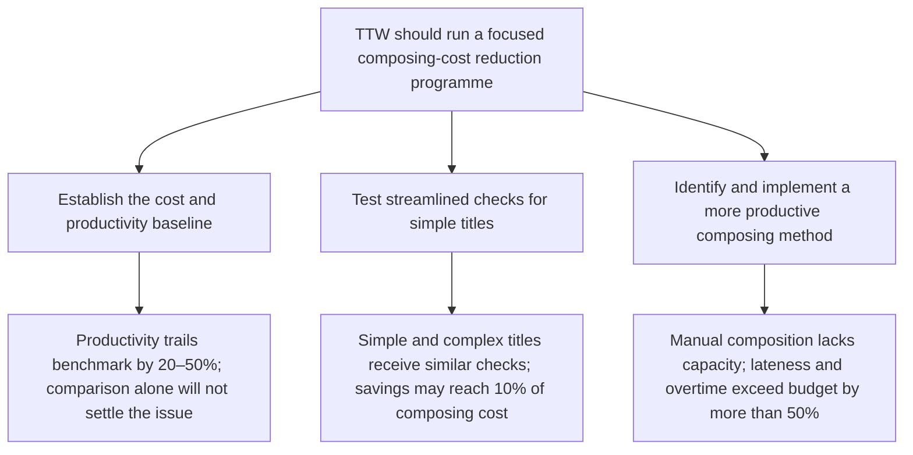

# TTW should run a focused composing-cost reduction programme: establish the cost baseline, test streamlined quality checks for simple titles, then redesign the composing method where productivity is below benchmark.

TTW’s composing room is capacity-constrained, jobs are running late, and overtime is more than 50% over budget. While industry comparisons suggest weak productivity and high cost, TTW has not yet established whether its costs are truly excessive or which changes will reduce them without harming quality or customers.

1. Establish the cost and productivity baseline  
   Compare TTW with three other printers and investigate why measured productivity trails the benchmark by 20–50%. The comparison should inform the diagnosis, not be treated as proof of the cause.

2. Test simpler quality-control processes for inexpensive titles  
   Trial fewer or differently timed checks on selected simple jobs, while measuring effects on quality and customers. Because simple and complex titles currently pass through essentially the same control stages, this could reduce total composing cost by up to 10%.

3. Identify and implement a more productive composing method  
   Run a methods study to determine how the composing method can be changed, prioritising manual composition, where capacity is especially tight. The work should address the hiring and retention pressure created by below-market pay, the loss of two employees, and rising overtime.

**Next step:** Agree the test scope and measures with George Kennedy, then assign ownership for the benchmarking and methods studies.

**Omitted or demoted:** interview details, general statements of managerial willingness, and the fact that managers disagree about whether costs are high; these provide background but do not support the recommended programme.

