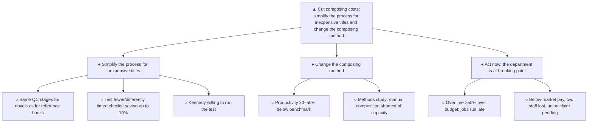

**To:** Engagement Manager
**From:** [Junior consultant]
**Subject:** Composing costs can be cut — by simplifying the process for inexpensive titles and by changing the composing method

Composition is our largest production cost — roughly 40% of hardback cost and 50–55% of paperback cost — and we are uncompetitive on simple work without knowing whether our composing costs are actually excessive. The past two weeks of work show that they are: every title, from a complex reference book to a simple novel, passes through essentially the same quality-control stages, and measured productivity trails the industry benchmark by 20–50%. Can we reduce these costs? Yes — two changes should deliver substantial savings, and both can be tested now.

**1. Simplify the process for inexpensive titles.**
Today a simple novel goes through the same checks as a complex reference book. We should test selected jobs and measure the effect of fewer or differently timed checks on quality and on customers. The saving could reach 10% of total composing cost. George Kennedy is willing to run this test.

**2. Change the composing method to raise productivity.**
Productivity trails the benchmark by 20–50%, so a separate methods study should identify where the composing method can be improved. The need is acute in manual composition, which is shortest of capacity.

**Why act now.** The department is overloaded and runs most jobs late; overtime is more than 50% over budget. Pay is below local market rates, we struggle to hire and retain compositors, we have just lost two employees, and the union is pressing a new claim. Costs will not improve on their own.

**Omitted from the original note:** the proposed comparison with three other printers (unlikely to settle the issue, by the author's own doubt), the list of people interviewed, and the managers' disagreement about whether costs are high — none of these supports the recommendation; what matters is that all concerned are willing to investigate. The structural change: the answer ("costs can be cut, here is how") moved from the last page to the subject line, the four mixed conclusions became two same-kind actions, and the capacity facts moved from the middle of the story into the case for urgency.

