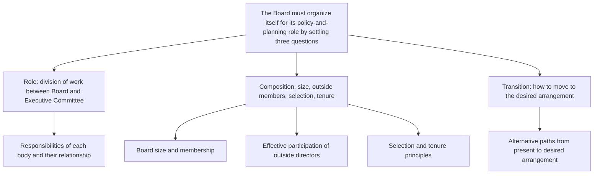

In October, the reorganization gave divisional managers full authority for day-to-day operations, leaving policy and planning as the Board's responsibility. Yet the Board has spent years absorbed in short-term operational problems and is not organized for the role it now owns. The question before us is what the Board must settle to take up that role properly.

The answer is three things:

1. **Define the Board's role and its working relationship with the Executive Committee** — the broad responsibilities of each body and how they divide the work between them.
2. **Determine the Board's composition** — its optimum size and membership, how to make an outside director an effective participant, and the principles for selecting directors and setting their tenure.
3. **Plan the transition** — alternative ways to move from the present Board and Executive Committee arrangement to the desired one.

