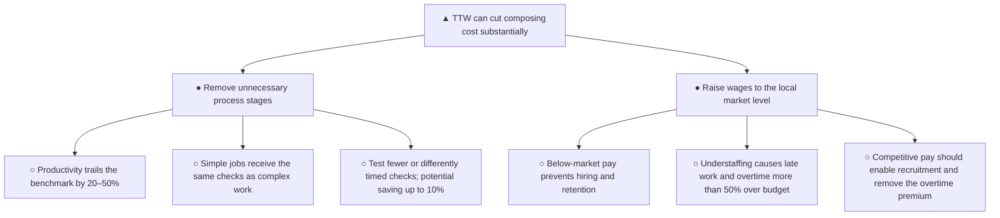

```mermaid
flowchart TD
    A["▲ TTW can cut composing cost substantially"] --> B1["● Remove unnecessary process stages"]
    A --> B2["● Raise wages to the local market level"]

    B1 --> C11["○ Productivity trails the benchmark by 20–50%"]
    B1 --> C12["○ Simple jobs receive the same checks as complex work"]
    B1 --> C13["○ Test fewer or differently timed checks; potential saving up to 10%"]

    B2 --> C21["○ Below-market pay prevents hiring and retention"]
    B2 --> C22["○ Understaffing causes late work and overtime more than 50% over budget"]
    B2 --> C23["○ Competitive pay should enable recruitment and remove the overtime premium"]
```