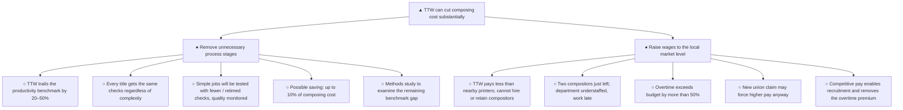
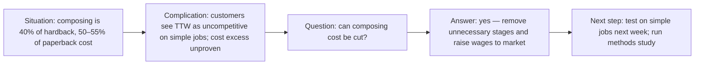

```mermaid
flowchart TD
    A["▲ TTW can cut composing cost substantially"]
    A --> B1["● Remove unnecessary process stages"]
    A --> B2["● Raise wages to the local market level"]

    B1 --> C11["○ TTW trails the productivity benchmark by 20–50%"]
    B1 --> C12["○ Every title gets the same checks regardless of complexity"]
    B1 --> C13["○ Simple jobs will be tested with fewer / retimed checks, quality monitored"]
    B1 --> C14["○ Possible saving: up to 10% of composing cost"]
    B1 --> C15["○ Methods study to examine the remaining benchmark gap"]

    B2 --> C21["○ TTW pays less than nearby printers; cannot hire or retain compositors"]
    B2 --> C22["○ Two compositors just left; department understaffed, work late"]
    B2 --> C23["○ Overtime exceeds budget by more than 50%"]
    B2 --> C24["○ New union claim may force higher pay anyway"]
    B2 --> C25["○ Competitive pay enables recruitment and removes the overtime premium"]
```

```mermaid
flowchart LR
    S["Situation: composing is 40% of hardback, 50–55% of paperback cost"] --> C["Complication: customers see TTW as uncompetitive on simple jobs; cost excess unproven"]
    C --> Q["Question: can composing cost be cut?"]
    Q --> A["Answer: yes — remove unnecessary stages and raise wages to market"]
    A --> N["Next step: test on simple jobs next week; run methods study"]
```
