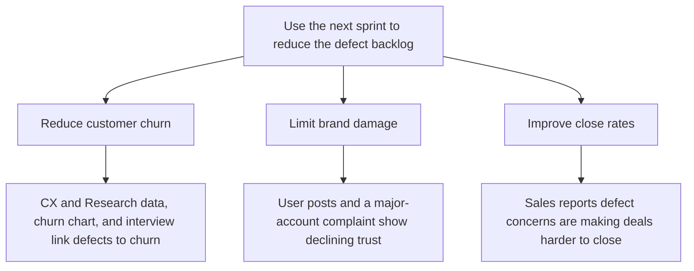

Subject: Make reducing the defect backlog the next sprint’s focus

Alex — the defect backlog is growing faster than we close it and is projected to worsen over the next year. We should use the next sprint to reduce it because it is increasing customer churn, damaging our brand, and making new deals harder to close.

1. Customers are leaving: Customer Experience and Research link defects to churn, supported by the churn-versus-defect chart and an interview.
2. Our reputation is deteriorating: user posts and a major-account complaint show defects are harming trust.
3. Sales is losing momentum: Sales reports that defect concerns are making deals harder to close.

Please prioritize backlog reduction for the next sprint.

