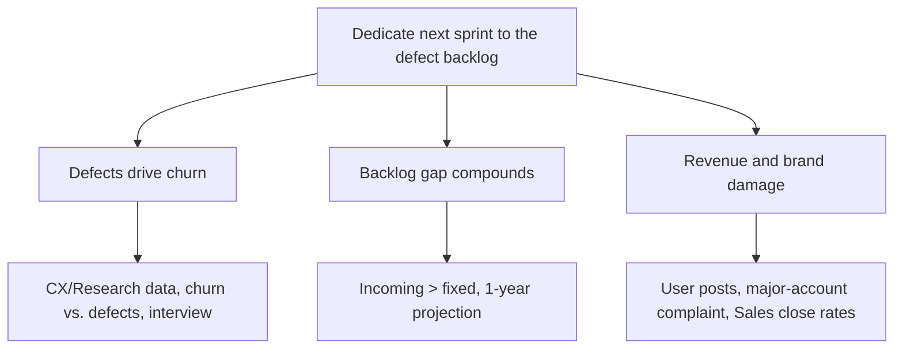

Subject: Next sprint should go to the defect backlog — it's now costing us customers and deals

Alex,

You set the next sprint's focus, and the backlog question has become a business question. Incoming defects have outpaced fixes for months, and on the current trend the backlog keeps growing for at least the next year. I recommend dedicating the next sprint to reducing it, for three reasons:

1. **Defects are driving churn.** CX and Research both tie defect exposure to customer departures; churn tracks defect volume, and a customer interview tells the same story.
2. **The gap compounds.** New defects arrive faster than we close them; every sprint we defer, the backlog — and the projection — gets worse.
3. **It's now hitting revenue and brand.** User posts and a complaint from a major account are public, and Sales reports these concerns are making deals harder to close.

Decision needed: confirm the next sprint goes to backlog reduction.

