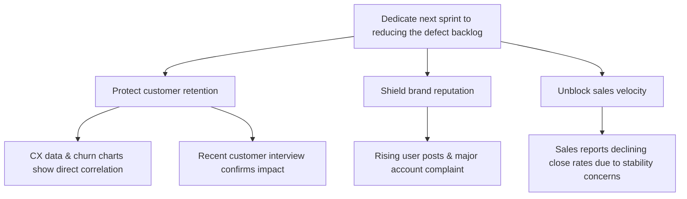

Subject: Next sprint priority: defect backlog reduction

We are planning the next sprint’s focus, but the defect backlog is now outpacing our resolution rate and projecting further growth over the next year. This instability is actively driving customer churn, triggering negative public sentiment and a key account complaint, and causing Sales to report declining close rates. Given these compounding risks, we should dedicate the next sprint to reducing the defect backlog.

Why this is the right move:
• Protect customer retention: CX data and churn-vs-defect charts show a direct correlation between backlog growth and attrition, reinforced by a recent customer interview.
• Shield brand reputation: Rising user posts and a formal grievance from a major account indicate accelerating reputational damage.
• Unblock sales velocity: Sales teams report that stability concerns are lengthening deal cycles and lowering close rates.

Please confirm if we can lock this as the sprint priority.

