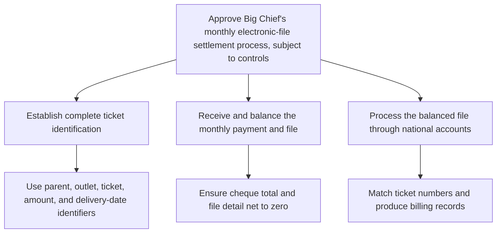

**To:** Robert Salton  
**From:** John Jackson  
**Subject:** Approve Big Chief’s monthly electronic-file settlement process

Big Chief proposes replacing individual delivery-ticket settlement with a monthly electronic file and one prepaid payment. The process can be accommodated through the national-accounts settlement process, provided the following controls are applied.

1. **Establish complete ticket identification.**  
   Each file must include the parent number, outlet number, ticket number, amount, and delivery date. If Big Chief cannot supply the parent and outlet numbers, we can provide them from the customer master file for later submissions.

2. **Receive and balance the monthly payment and file.**  
   Big Chief will extract the data from its accounts-payable file in the required format, send the file to Data Processing, and send the cheque and detailed listing to the lockbox. Finance will balance the file under the prescribed procedure; the cheque total and file detail must net to zero.

3. **Process the balanced file through national accounts.**  
   Once balanced, the file will run through the national-accounts system, match ticket numbers against statement history, and produce the relevant billing records.

