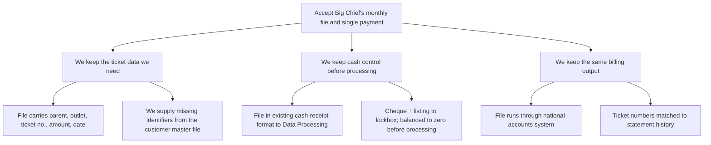

**To:** Robert Salton
**From:** John Jackson
**Subject:** We can accept Big Chief's monthly file-and-payment request

Big Chief (account 8306) has asked to stop settling delivery tickets individually and instead send us a monthly computer file with a single prepaid payment. We reviewed how that would work end to end: we recommend accepting, because the arrangement gives us the same ticket data, the same cash control, and the same billing output as today.

**1. We still get every identifier the settlement process needs.**
The file must carry the parent number, outlet number, ticket number, ticket amount and delivery date. If Big Chief cannot supply the parent and outlet numbers, we can provide them from the customer master file for inclusion in later submissions.

**2. We still control the cash before anything is processed.**
Big Chief writes an extraction program against its accounts-payable file and produces the file in the format our national-accounts cash-receipt system already accepts. The file goes to Data Processing; the cheque and a detailed listing go to the lockbox. We balance the file under the prescribed procedure, and the cheque total and file detail must net to zero.

**3. We still produce the same billing records.**
Once balanced, the monthly file runs through the national-accounts system, matches ticket numbers against statement history, and produces the relevant billing records.

**What I need:** your approval to tell Big Chief to proceed with the extraction program.

[data needed: cost of the change, and the volume of tickets it removes from manual settlement — the review covered process feasibility only, not the financial case.]

**What changed:** the memo now opens with the recommendation rather than "our findings follow", and the three numbered items were recast from process mechanics into what management gets from the arrangement, with the mechanics moved underneath as support; the absence of a financial case is flagged rather than left implicit.
