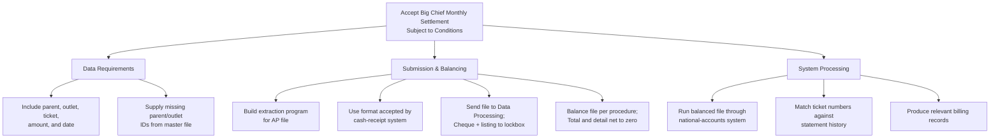

Subject: Accept Big Chief Monthly Settlement Request Subject to Conditions

Big Chief has requested to replace individual ticket settlements with a monthly electronic file and a single payment. Finance has reviewed the proposal and determined that implementation requires adherence to specific data standards, a defined submission workflow, and strict balancing controls. Accordingly, we can accept the request provided the following conditions are met.

1. Data Requirements
- The external account file must contain the parent number, outlet number, ticket number, ticket amount, and delivery date.
- If Big Chief cannot provide the parent or outlet numbers, we will supply these identifiers from the customer master file for inclusion in later submissions.

2. Submission and Balancing Procedures
- Big Chief must build an extraction program for its accounts-payable file.
- The resulting file must use the format accepted by our national-accounts cash-receipt system.
- Big Chief will send the file to Data Processing and deliver the cheque with a detailed listing to the lockbox.
- We will balance the file under the prescribed procedure, ensuring the cheque total and file detail net to zero.

3. System Processing and Billing
- Once balanced, the monthly file will run through the national-accounts system.
- The system will match ticket numbers against statement history and produce the relevant billing records.

