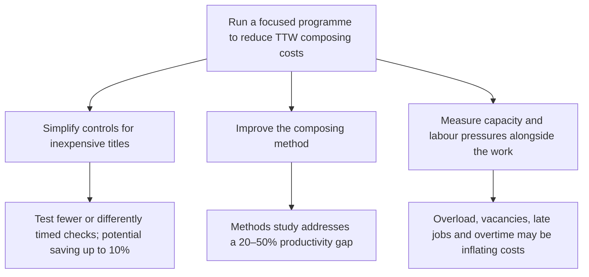

**Subject: Reduce TTW composing costs through targeted process and methods changes**

TTW’s composing costs are material, and TTW is uncompetitive on simple work. Yet managers do not know whether total costs are excessive or which changes will reduce them without harming quality. TTW should therefore run a focused cost-reduction programme: simplify controls for inexpensive titles and improve the composing method, using external comparisons only as context.

1. **Simplifying quality-control stages can reduce the cost of simple titles.**  
   Every title currently passes through essentially the same checks, whether it is a complex reference book or a simple novel. Test selected inexpensive jobs with fewer or differently timed checks; measure effects on quality and customers. The potential saving is up to 10% of total composing cost.

2. **Changing the composing method can close TTW’s productivity gap.**  
   TTW trails industry benchmarks by 20–50%. Commission a separate methods study to identify the changes needed to improve productivity.

3. **The programme should account for the operating pressures now raising cost and delaying work.**  
   The department is overloaded, with particular shortages in manual composition. TTW is struggling to recruit and retain staff because it pays below local market rates; two employees have recently left, most jobs are late, overtime is more than 50% over budget, and the union is pressing a new claim. These conditions should be measured alongside the trials so that process and productivity improvements are distinguished from temporary capacity pressures.

Use comparisons with three other printers to frame the findings, but do not rely on benchmarking alone to determine the cause or solution.

**Omitted or demoted:** interview details and managers’ general willingness to investigate; they do not support the recommendation directly.

