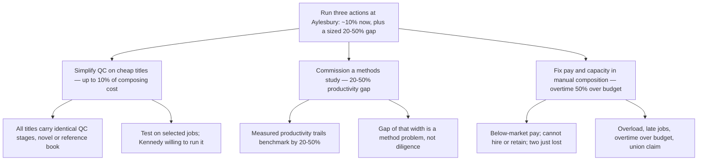

**To:** Engagement Manager
**From:** [Consultant]
**Subject:** TTW can take out roughly 10% of composing cost now, and we should size a further 20–50% gap

You asked what two weeks in Aylesbury turned up on composing-room costs. It turns up an answer, not just data: TTW does not need to settle the argument about whether its costs are "high" before acting — the cost structure already shows where the money is, and three actions will release it.

**Recommendation: run three actions at Aylesbury, in this order of payoff.**

---

**1. Simplify quality control on inexpensive titles — up to 10% of total composing cost.**

- Every title passes through essentially the same quality-control stages, whether it is a complex reference book or a simple novel; the checks priced for reference work are being applied to novels.
- The saving available from fewer or differently timed checks may reach 10% of total composing cost — the largest single figure we have, against a cost base that is ~40% of hardback and 50–55% of paperback cost.
- Test it on selected jobs and measure the effect on quality and on customers before generalising. George Kennedy is willing to run this test.

**2. Commission a methods study on the composing method — the gap is 20–50%.**

- Measured productivity at TTW trails the industry benchmark by 20–50%; industry comparisons point to weak productivity and high cost.
- A gap of that width is a method problem, not a diligence problem, and only a methods study will convert it into a number we can bank. Kennedy is also willing to test why measured productivity trails the benchmark.
- `[data needed: the specific saving a change of composing method would yield — this note cannot size it]`

**3. Fix pay and capacity in manual composition — overtime is already 50% over budget.**

- TTW pays below local market rates, cannot hire or retain compositors, and has just lost two employees.
- The department is overloaded, manual composition most acutely; most jobs now run late.
- The cost of that shortfall is being paid twice: overtime more than 50% over budget, and a union claim now on the table that a below-market pay position makes hard to resist.

---

**What I need from you:** agreement to start action 1 with Kennedy next week, and a decision on whether the methods study (action 2) is in scope for this engagement or a follow-on.

**Omitted or demoted:** the proposed comparison with three other printers — a simple comparison will not settle whether TTW's costs are excessive, and actions 1 and 2 answer the underlying question directly. Also demoted: that managers disagree about whether costs are high (they all accept an investigation, so it blocks nothing), and the record of interviews with Roy Walter, Brian Thompson and George Kennedy, which is source, not argument.

**What changed structurally:** the note now opens with the recommendation instead of a record of activity, and its first level holds three actions ranked by payoff rather than a mix of findings, interviews and hedged conclusions; the facts that formerly carried the note — the overload, the pay position, the benchmark gap — sit underneath the action each one justifies.
