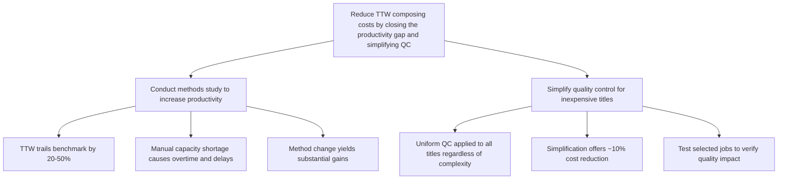

Subject: Reducing TTW Composing Costs: Recommendations for Savings and Productivity

Composition accounts for 40–55% of book costs, and TTW is uncompetitive on simple work. A recent review identified significant productivity gaps, capacity constraints, and clear opportunities for savings by streamlining processes and changing methods. We propose two actions to address these issues.

### Increase productivity through a methods study

*   TTW's measured productivity trails the industry benchmark by 20–50%, indicating substantial room for improvement.
*   Manual composition is currently overloaded, causing overtime to exceed budget by over 50% and resulting in frequent job delays.
*   Adopting a more efficient composing method will resolve these capacity bottlenecks and lower unit costs.

### Simplify quality control for inexpensive titles

*   TTW subjects every title, from complex reference books to simple novels, to identical quality-control stages.
*   Streamlining checks for less demanding titles could reduce total composing costs by approximately 10%.
*   We should test selected jobs to measure the effect of fewer or differently timed checks on quality and customer satisfaction.

**Next step:** Authorize Kennedy to proceed with the quality-control test and commission the methods study.

---

**Material omitted or demoted**

*   **Comparison with three other printers:** Demoted; the review doubts a simple comparison will settle the issue.
*   **Interview details with staff:** Removed as operational background.
*   **Managers' disagreement on cost levels:** Removed; consensus exists to investigate.
*   **Specific union claim details:** Removed as a symptom of the broader capacity and cost issues addressed above.

