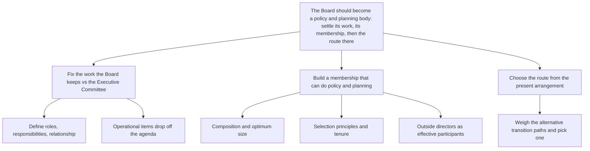

Since October, divisional managers have held full authority for day-to-day operations, leaving policy and planning as the Board's own work. The Board has nevertheless gone on spending its meetings on short-term operational problems, so the reorganization has changed who runs the business without yet changing what the Board does.

**The Board should now convert itself into a policy and planning body, by settling three things in this order: the work it keeps, the membership that work requires, and the route from today's arrangement to it.**

**1. Fix the work the Board keeps and the work the Executive Committee takes.**
- Set out the broad role of each body, the responsibilities that follow, and the relationship between them.
- Everything operational that the divisions now own drops out of the Board's agenda by the same act.

**2. Build a membership that can do policy and planning.**
- Set the Board's composition and its optimum size against that work rather than against present numbers.
- Adopt principles for selecting directors and for their tenure, so membership keeps matching the work.
- Make the outside director an effective participant, so outside judgement reaches the policy decisions instead of sitting beside them.

**3. Choose the route from the present arrangement to the intended one.**
- Weigh the alternative ways of moving from today's Board and Executive Committee split to the agreed one, and pick the one the Board can carry through.

*Order: sequential — each decision constrains the next; membership cannot be sized before the work is defined, and no transition can be chosen before both.*

Structurally: the list of five discussion topics became one answer with three sequenced decisions, with the former items 1, 3 and 4 grouped as membership questions under the role definition they depend on.
