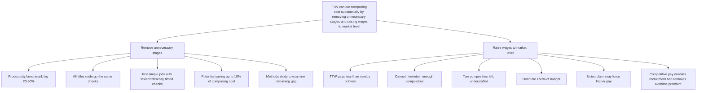
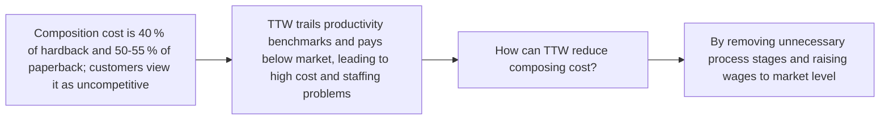

```mermaid
flowchart TD
    A["TTW can cut composing cost substantially by removing unnecessary stages and raising wages to market level"] --> B1["Remove unnecessary stages"]
    A --> B2["Raise wages to market level"]
    B1 --> C11["Productivity benchmark lag 20‑50%"]
    B1 --> C12["All titles undergo the same checks"]
    B1 --> C13["Test simple jobs with fewer/differently timed checks"]
    B1 --> C14["Potential saving up to 10% of composing cost"]
    B1 --> C15["Methods study to examine remaining gap"]
    B2 --> C21["TTW pays less than nearby printers"]
    B2 --> C22["Cannot hire/retain enough compositors"]
    B2 --> C23["Two compositors left; understaffed"]
    B2 --> C24["Overtime >50% of budget"]
    B2 --> C25["Union claim may force higher pay"]
    B2 --> C26["Competitive pay enables recruitment and removes overtime premium"]
```

```mermaid
flowchart LR
    S["Composition cost is 40 % of hardback and 50‑55 % of paperback; customers view it as uncompetitive"] --> C["TTW trails productivity benchmarks and pays below market, leading to high cost and staffing problems"]
    C --> Q["How can TTW reduce composing cost?"]
    Q --> A["By removing unnecessary process stages and raising wages to market level"]
```
