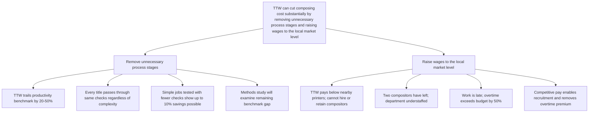
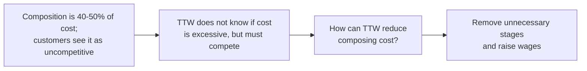

```mermaid
flowchart TD
    A["TTW can cut composing cost substantially by removing unnecessary process stages and raising wages to the local market level"] --> B1["Remove unnecessary process stages"]
    A --> B2["Raise wages to the local market level"]
    
    B1 --> C11["TTW trails productivity benchmark by 20-50%"]
    B1 --> C12["Every title passes through same checks regardless of complexity"]
    B1 --> C13["Simple jobs tested with fewer checks show up to 10% savings possible"]
    B1 --> C14["Methods study will examine remaining benchmark gap"]
    
    B2 --> C21["TTW pays below nearby printers; cannot hire or retain compositors"]
    B2 --> C22["Two compositors have left; department understaffed"]
    B2 --> C23["Work is late; overtime exceeds budget by 50%"]
    B2 --> C24["Competitive pay enables recruitment and removes overtime premium"]
```

```mermaid
flowchart LR
    S["Composition is 40-50% of cost;<br/>customers see it as uncompetitive"] --> C["TTW does not know if cost<br/>is excessive, but must compete"]
    C --> Q["How can TTW reduce<br/>composing cost?"]
    Q --> A["Remove unnecessary stages<br/>and raise wages"]
```
