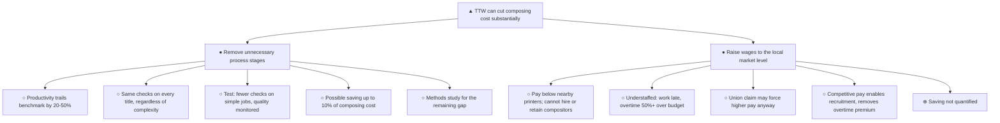
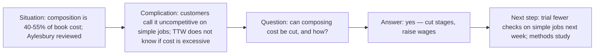

## Annotated structure

Legend: `▲` top / answer · `●` first-level group · `○` supporting detail · `⊕` gap

```text
Subject: TTW composing cost

○ [Situation] During the past two weeks I reviewed the Aylesbury composing room.
  Composition represents about 40% of hardback cost and 50-55% of paperback cost.
○ [Complication] TTW does not know whether the cost is excessive, but customers
  regard it as uncompetitive on simple jobs.
   [Question — implied] Can composing cost be cut, and how?

▲ Our preliminary work indicates that TTW can cut composing cost substantially by:
  ● removing unnecessary process stages;
  ● raising wages to the local market level.

● REMOVE UNNECESSARY STAGES
  ○ TTW trails the productivity benchmark by 20-50%.
  ○ Every title passes through essentially the same checks regardless of complexity.
  ○ Next week, selected simple jobs will be tested with fewer or differently timed
    checks, while quality and customer reaction are monitored.
  ○ The possible saving is up to 10% of composing cost.
  ○ A methods study will examine the remaining benchmark gap.

● RAISE WAGES
  ○ TTW pays less than nearby printers and cannot hire or retain enough compositors.
    Two have just left.
  ○ The department is understaffed, most work is late, and overtime exceeds budget
    by more than 50%.
  ○ A new union claim may force higher pay.
  ○ Competitive pay should make recruitment possible and remove the overtime premium.
  ⊕ No quantified saving for this branch, unlike branch 1.
```

## Pyramid



## SCQ ribbon



## Structure notes

| Item | Reading |
|---|---|
| Top | Answers the reader's question in one sentence; actionable |
| Kind | Both branches are actions — same kind, fits one plural noun ("measures") |
| Order | Ranking: the quantified, immediately testable measure first |
| MECE | No overlap between the two branches; only two branches, which the material supports |
| Gap `⊕` | Branch 2 carries no saving estimate, so the branches are not comparable in weight |
