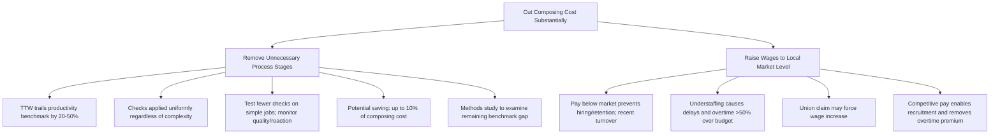

```mermaid
graph TD
    Root[Cut Composing Cost Substantially]
    
    Root --> S1[Remove Unnecessary Process Stages]
    Root --> S2[Raise Wages to Local Market Level]
    
    S1 --> F1_1[TTW trails productivity benchmark by 20-50%]
    S1 --> F1_2[Checks applied uniformly regardless of complexity]
    S1 --> F1_3[Test fewer checks on simple jobs; monitor quality/reaction]
    S1 --> F1_4[Potential saving: up to 10% of composing cost]
    S1 --> F1_5[Methods study to examine remaining benchmark gap]
    
    S2 --> F2_1[Pay below market prevents hiring/retention; recent turnover]
    S2 --> F2_2[Understaffing causes delays and overtime >50% over budget]
    S2 --> F2_3[Union claim may force wage increase]
    S2 --> F2_4[Competitive pay enables recruitment and removes overtime premium]
```
