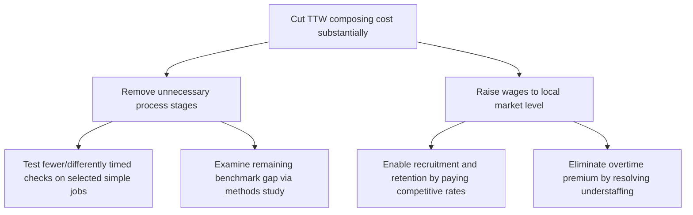

```mermaid
flowchart TD
    A["Cut TTW composing cost substantially"] --> B1["Remove unnecessary process stages"]
    A --> B2["Raise wages to local market level"]
    B1 --> C11["Test fewer/differently timed checks on selected simple jobs"]
    B1 --> C12["Examine remaining benchmark gap via methods study"]
    B2 --> C21["Enable recruitment and retention by paying competitive rates"]
    B2 --> C22["Eliminate overtime premium by resolving understaffing"]
```
