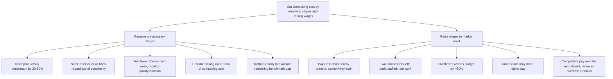
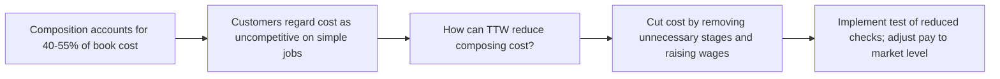

| Marker | Meaning |
|---|---|
| `▲` | top / answer |
| `●` | first-level group |
| `○` | supporting detail |
| `⚠` | violation (mixed kinds, unexplainable order, false grouping) |
| `↑` | conclusion buried lower than it belongs — promote it |
| `⇄` | wrong order type here |
| `⊗` | overlap (ME broken) |
| `⊕` | gap (CE broken) |
| `✂` | cut, or move to an appendix |

### Annotated Text

**Subject:** TTW composing cost

● Situation: During the past two weeks I reviewed the Aylesbury composing room. Composition represents about 40% of hardback cost and 50-55% of paperback cost.

⚠ Complication: Customers regard the cost as uncompetitive on simple jobs. TTW does not know whether the cost is excessive.

▲ Answer: Our preliminary work indicates that TTW can cut composing cost substantially by:

● REMOVE UNNECESSARY STAGES ⇄
○ TTW trails the productivity benchmark by 20-50%.
○ Every title passes through essentially the same checks regardless of complexity.
○ Next week, selected simple jobs will be tested with fewer or differently timed checks, while quality and customer reaction are monitored.
○ The possible saving is up to 10% of composing cost.
○ A methods study will examine the remaining benchmark gap.

● RAISE WAGES
○ TTW pays less than nearby printers and cannot hire or retain enough compositors.
○ Two have just left.
○ The department is understaffed, most work is late, and overtime exceeds budget by more than 50%.
○ A new union claim may force higher pay; competitive pay should make recruitment possible and remove the overtime premium.

### Pyramid Diagram

### SCQ Ribbon

### Gap Table

| Item | Status | Detail |
|---|---|---|
| Order Type | Missing | No order type named for the two groups; appears arbitrary rather than ranked, structured, or temporal. |
| Wage Savings Quantification | Gap | No figures provided for the net financial impact of raising wages (cost increase vs. overtime/recruitment savings). |
| Customer Benchmark Data | Gap | No data on competitor pricing or specific customer complaints to quantify the "uncompetitive" claim. |
