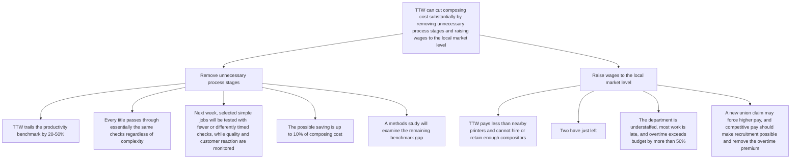

```mermaid
graph TD
    G["TTW can cut composing cost substantially by removing unnecessary process stages and raising wages to the local market level"]
    G --> A["Remove unnecessary process stages"]
    G --> B["Raise wages to the local market level"]

    A --> A1["TTW trails the productivity benchmark by 20-50%"]
    A --> A2["Every title passes through essentially the same checks regardless of complexity"]
    A --> A3["Next week, selected simple jobs will be tested with fewer or differently timed checks, while quality and customer reaction are monitored"]
    A --> A4["The possible saving is up to 10% of composing cost"]
    A --> A5["A methods study will examine the remaining benchmark gap"]

    B --> B1["TTW pays less than nearby printers and cannot hire or retain enough compositors"]
    B --> B2["Two have just left"]
    B --> B3["The department is understaffed, most work is late, and overtime exceeds budget by more than 50%"]
    B --> B4["A new union claim may force higher pay, and competitive pay should make recruitment possible and remove the overtime premium"]
```
