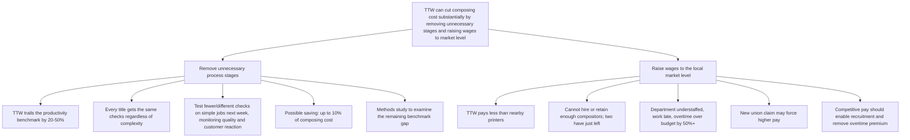
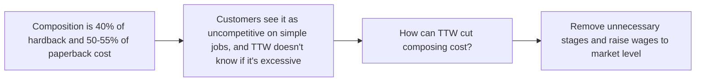

```mermaid
flowchart TD
    A["TTW can cut composing cost substantially by removing unnecessary stages and raising wages to market level"] --> B1["Remove unnecessary process stages"]
    A --> B2["Raise wages to the local market level"]

    B1 --> C11["TTW trails the productivity benchmark by 20-50%"]
    B1 --> C12["Every title gets the same checks regardless of complexity"]
    B1 --> C13["Test fewer/different checks on simple jobs next week, monitoring quality and customer reaction"]
    B1 --> C14["Possible saving: up to 10% of composing cost"]
    B1 --> C15["Methods study to examine the remaining benchmark gap"]

    B2 --> C21["TTW pays less than nearby printers"]
    B2 --> C22["Cannot hire or retain enough compositors; two have just left"]
    B2 --> C23["Department understaffed, work late, overtime over budget by 50%+"]
    B2 --> C24["New union claim may force higher pay"]
    B2 --> C25["Competitive pay should enable recruitment and remove overtime premium"]
```

```mermaid
flowchart LR
    S["Composition is 40% of hardback and 50-55% of paperback cost"] --> C["Customers see it as uncompetitive on simple jobs, and TTW doesn't know if it's excessive"]
    C --> Q["How can TTW cut composing cost?"]
    Q --> A["Remove unnecessary stages and raise wages to market level"]
```
