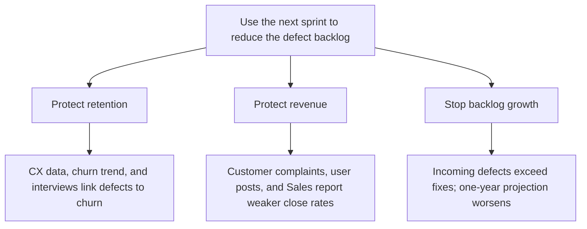

Subject: Make defect-backlog reduction the next sprint’s focus

The defect backlog is growing faster than we are closing it and is projected to worsen over the next year. We should use the next sprint to reduce it because it is now affecting:

1. Retention — Customer Experience data, churn trends alongside defect volume, and user interviews link defects to customer loss.
2. Revenue — a major-account complaint, user posts, and Sales reports show defects are damaging trust and making deals harder to close.
3. Delivery risk — the incoming-versus-fixed-defect trend shows the backlog will continue to grow unless we intervene now.

Please confirm this as the next sprint’s priority.

