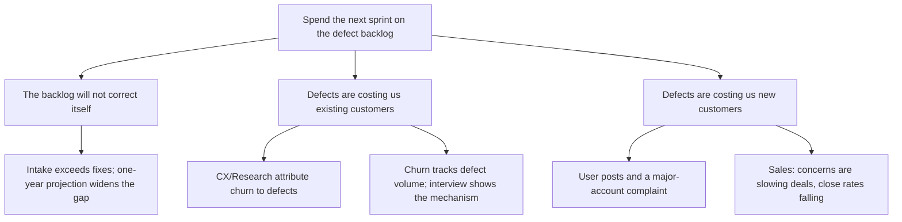

Hi Alex,

**Let's dedicate the next sprint to cutting the defect backlog.** We are closing fewer defects than we take in, and the cost of that gap has moved from engineering into revenue.

**1. The backlog will not correct itself.** New defects have outpaced fixes for long enough that the trend is stable, and the one-year projection from that trend shows the gap widening rather than levelling off (chart 1).

**2. Defects are already costing us existing customers.** Customer Experience and Research attribute churn to defects; churn plotted against defect volume moves together (chart 2), and the customer interview shows the mechanism behind the correlation.

**3. They are now costing us new customers too.** User posts and a complaint from a major account are public; Sales reports that these concerns are making deals harder to close, and close rates are falling.

**What I need:** your agreement to point the next sprint at the backlog. [data needed: how much of the gap one sprint can close — I'll get an estimate from engineering before we lock scope.]

**What changed structurally:** the recommendation moved from the last line to the first, and the evidence was regrouped as three reasons Alex gains from acting — each with its charts and reports demoted to support — ordered by escalating business cost.
