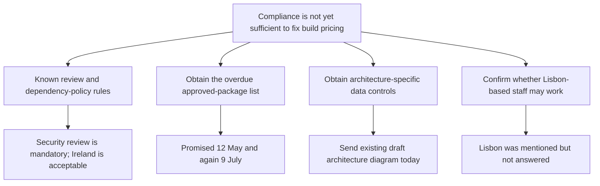

Compliance is not yet sufficient to price the build: send Aldergate the draft architecture today and secure named-owner responses on packages, architecture requirements, and Lisbon access.

Already answered: a security review is mandatory before production; any penetration test and critical-dependency assessment are decided within that review; an internal hardening framework and open-source policy exist; Ireland-based work is acceptable.

Still needed from Aldergate: the approved-package list (overdue since 12 May; now with R. Whitcombe), data-storage/encryption/logging requirements after the architecture walkthrough (contact S. Okafor), and explicit approval for Fernway engineers working from Lisbon. No standard dependency-approval turnaround is available.

