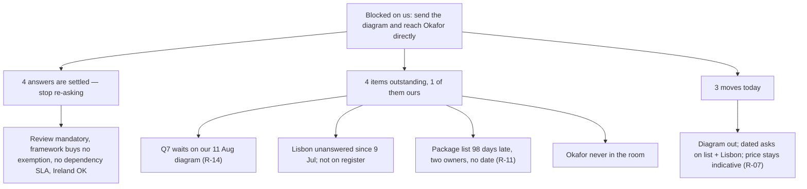

**The compliance track is blocked on us, not on Aldergate: send the architecture diagram today and get a dated commitment from Okafor directly — three of the four open items can't move until those two things happen.**

**What is already answered (treat as settled, don't re-ask)**
- A security review before production is mandatory, and a penetration test may be added inside it — so the build price cannot be fixed to a scope until the review is underway (Q1, Q2; R-07 open since 3 May).
- Building to Aldergate's internal hardening framework will not buy an exemption; the review happens regardless (Q2).
- Dependencies are judged inside the review, not pre-approved one by one, and there is no turnaround commitment we can plan against (Q4, Q5).
- Work from Ireland is permitted (Q6).

**What still has to be obtained — in the order it blocks us**
1. **Data storage, encryption and logging requirements (Q7).** Declined pending an architecture diagram. Our draft has existed since 11 August and has not been sent (R-14). This is the only blocker fully in our hands.
2. **A ruling on Lisbon.** Only Ireland was ever approved. The PM raised the two Lisbon-based engineers on 9 July and Aldergate did not respond — silence, not consent. This is not on the risk register and should be.
3. **The approved-package list.** Promised 12 May by Mercer, again 9 July by Whitcombe, still absent at 98 days with no date attached (Q3, R-11). Two owners, no deadline.
4. **Direct access to S. Okafor.** The information security owner has never attended a joint meeting; everything routes through Whitcombe. Every item above depends on a decision only Okafor can make.

**What to do today**
- Send the 11 August draft architecture diagram to Whitcombe and Okafor together, closing R-14 and putting Q7 in play.
- Ask in the same message for a dated commitment on the package list and a written answer on Lisbon — naming both dates you need.
- Add a Lisbon-location risk row to the register; keep R-07 open and flag to the client that build-phase pricing stays indicative until review scope is known.

