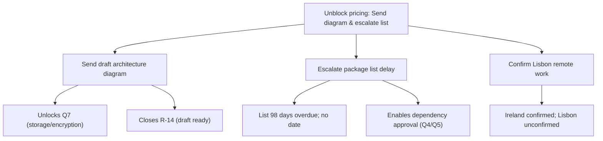

**Subject: Unblock pricing today: Send architecture diagram and escalate package list**

Build-phase pricing is stuck because security requirements are unconfirmed. Aldergate declined to answer data storage questions without our architecture diagram, and the approved-package list is 98 days overdue with no delivery date. To unblock pricing today, send the draft architecture diagram and escalate the package list delay.

● **Send draft architecture diagram to Aldergate**
○ Triggers answer to Q7 (storage/encryption/logging), which was declined without architectural context.
○ Closes R-14; draft has been ready since 11 August.

● **Escalate approved-package list delay to S. Okafor or D. Mercer**
○ List is 98 days overdue (first promised 12 May, renewed 9 July); current status is "being prepared" with no date.
○ Dependency approval (Q4/Q5) and final pricing certainty depend on receiving this list.

● **Confirm remote work eligibility for Lisbon-based engineers**
○ Source 1 confirms Ireland only; Lisbon status is unconfirmed and poses a resource rejection risk.

**Next step:** Send diagram and escalate list by EOD today.

