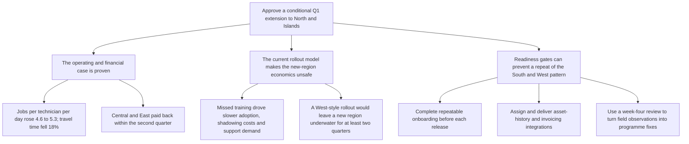

# Decision: extend Fieldbook to North and Islands in Q1 — only with readiness gates completed before each go-live

Fieldbook has improved operating efficiency in the four live regions and paid back within the second quarter in Central and East. However, South and West show that an underprepared rollout remains at break-even and can leave a new region underwater for at least two quarters. The COO should approve a conditional Q1 extension, releasing each region only after onboarding, integration ownership, and a repeatable go-live review are in place.

## 1. The operating and financial case supports extension

- Scheduling density improved across the four live regions:
  - completed jobs per technician per day rose from 4.6 to 5.3;
  - travel time between jobs fell 18%;
  - same-day emergency insertion is now automatic, with a median completion time of four minutes rather than dispatcher phone calls.

- These gains are translating into lower operating costs:
  - overtime spending is down 12% quarter over quarter;
  - fuel cost per job is down 9%;
  - Finance attributes the overtime reduction mainly to scheduling gains.

- The proven economics are positive in regions that adopted quickly:
  - Central and East reached full adoption within six weeks and recovered running costs within the second quarter;
  - licence and hosting costs for the four live regions are £31,000 per month;
  - extending to North and Islands adds £13,500 per month in licences.

- Fieldbook is becoming operationally useful beyond scheduling:
  - it is the source of record for job status in the four live regions;
  - regional managers use its dashboard in Monday reviews;
  - all 41 dispatchers used Fieldbook scheduling from week one after the legacy spreadsheet was switched off.

## 2. The current rollout model would put the Q1 economics at risk

- Adoption varies materially with access to formal onboarding:
  - 412 of 486 field technicians have activated accounts, and 83% of work orders are created and closed in Fieldbook;
  - South took 11 weeks to exceed 80% of orders in the system;
  - West remains at 71% after nine weeks;
  - the classroom course ran only once per region, leaving later hires and absentees to learn from colleagues;
  - 34 of 118 West technicians attended no session.

- The resulting workaround is costly:
  - shadowing in South and West consumed an estimated 380 technician-hours of route time;
  - it worked, but took experienced technicians off their own routes;
  - winter travel will be required for any classroom training in North and Islands.

- Support demand confirms that missed onboarding is the main avoidable burden:
  - the desk logged 1,940 tickets over two quarters;
  - volumes peaked in each region’s third week, then declined steadily;
  - 44% were password-reset and login issues, concentrated among technicians who missed classroom training and had not logged in during the supported window;
  - weekly one-hour webinars reach only 20–30 technicians, although attendance is strongest where classroom places were missed;
  - the support desk concludes it is covering the training programme’s role at ticket prices.

- The financial consequence is clear:
  - South and West are roughly at break-even because adoption was slower;
  - repeating the West pattern in North or Islands would put the new regions underwater for at least two quarters.

## 3. Kestrel must close known system gaps and govern the rollout before extending

### A. Make onboarding a release condition

- Provide scheduled initial training plus a catch-up path for hires and absentees.
- Require activation and supported first login before technicians operate independently.
- Retain webinars as reinforcement, not as the primary onboarding mechanism.
- Track adoption weekly and prevent the next regional release until the current region meets the agreed threshold.

### B. Assign and complete integration ownership

- **Asset history:** evaluate and implement the supported connector or nightly export from the legacy asset register.
  - Technicians currently open jobs without equipment service history.
  - They call the back office or ask customers for context.
  - In 9% of audited jobs, parts were replaced despite having been replaced under warranty within the preceding year.
  - The missing feed leaves every equipment-history panel empty, hides warranty status, and makes the audit trail unusable for dispute resolution.
  - The asset-register export requested in month two remains in backlog.

- **Completion-code mapping:** schedule the vendor’s configurable mapping table and name a Kestrel integration owner.
  - Fieldbook and invoicing codes currently differ.
  - Billing re-keys roughly 300 records per week, creating transcription errors found by customers on invoices.
  - One temporary clerk cost £8,400 over the two quarters.
  - Reporting and invoicing completed-job counts differ by 2–4% in a typical week, requiring month-end reconciliation.
  - The vendor says the mapping takes roughly one day to configure; the issue remains unscheduled because no Kestrel owner is assigned.

- **Customer-record search:** resolve or mitigate the exact-postcode search limitation.
  - It causes duplicate customer records; 19% of support tickets concern duplicates.
  - Support merges about 70 records per week.
  - Until merged, affected customers’ job histories are split across records.

- The vendor’s catalogue contains supported connectors for both the asset-register database and invoicing import format. IT considers both straightforward, but integration work was not scoped into the deployment-and-training programme.

### C. Run North and Islands as a controlled programme, not two repeated local deployments

- Establish a programme-level week-four review that converts field observations into fixes before the next release.
- Use Central and East as the adoption benchmark and pause release if North or Islands tracks the South/West pattern.
- Assign clear owners for training, integration, support escalation, and regional readiness.
- Keep vendor involvement focused on Kestrel decisions: vendor response times are within contract, and solutions to both known system gaps are awaiting Kestrel action rather than vendor development.
- Address the parts-ordering screen through adoption support rather than defect remediation: technicians still mostly order by phone, but testing indicates the screen works correctly.

## What I need now

Approve a conditional Q1 extension to North and Islands, with authority to proceed region by region only after the onboarding plan, integration owners and delivery schedule, and week-four go-live governance are confirmed.

