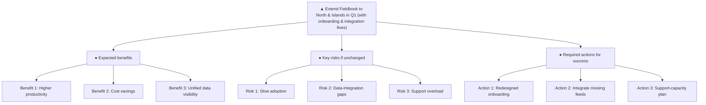

▲ **Answer:** Extend Fieldbook to the North and Islands in Q1 — but only after redesigning onboarding to match the rapid adoption seen in Central and East and addressing the two integration gaps (asset‑register feed and invoicing code mapping).

**Situation** – You have seen the two‑quarter rollout in four regions: adoption reached 83 % of work orders, scheduling density rose 15 % and travel time fell 18 %, delivering clear operational and financial gains.  
**Complication** – Adoption lagged in South and West because a single classroom session left many technicians untrained; the platform still lacks two critical data feeds, generating duplicate records, warranty‑replacement errors and manual re‑keying that cost overtime and introduce billing errors.  
**Question** – Should we roll Fieldbook out to the remaining two regions (North and Islands) at the start of Q1?  

### 1. Expected benefits (why the extension adds value)  
- **Higher productivity** – Replicating the 0.7‑job‑per‑day increase will lift daily jobs per technician from 4.6 → 5.3, cutting travel time by another ~10 % in the new regions.  
- **Cost savings** – Overtime is down 12 % and fuel cost per job down 9 % in the four live regions; extending should generate similar savings, offsetting the £13,500 monthly licence fee within two quarters.  
- **Improved data visibility** – Fieldbook’s dashboard already serves as the source of truth for job status; adding North and Islands gives a unified view across all six regions, simplifying performance monitoring.  

### 2. Key risks if we proceed without changes (what could undermine the rollout)  
- **Slow adoption** – The single‑session classroom model caused 34 % of West technicians to miss training, leading to 71 % adoption after nine weeks; a repeat would delay benefits and increase shadow‑training hours (≈380 lost route‑hours per region).  
- **Data‑integration gaps** – Missing asset‑register feed caused 9 % of jobs to repeat warranty parts; mismatched invoicing codes force manual re‑keying of ~300 records weekly, creating billing errors and extra clerk costs (£8.4 k per two quarters).  
- **Support overload** – 44 % of tickets are password resets from untrained staff; duplicate‑record tickets add ~70 manual merges per week, straining the support desk and increasing operational friction.  

### 3. Required actions to ensure a successful extension (how to neutralise the risks)  
- **Redesigned onboarding** – Schedule at least two classroom sessions per region, staggered to cover new hires and absentees; supplement with on‑site shadowing that does not pull technicians off routes (e.g., pair‑learning during low‑demand periods).  
- **Integrate missing data feeds** – Deploy the vendor‑provided asset‑register connector and configure the invoicing‑code mapping table before go‑live; assign a dedicated integration owner in IT to track progress.  
- **Support‑capacity plan** – Pre‑stage a “first‑week” help‑desk sprint staffed with two extra technicians to handle password resets and duplicate‑record merges, then taper as adoption stabilises.  

**Next step** – Approve the Q1 extension contingent on the onboarding and integration plan being signed off by the end of next week.  

