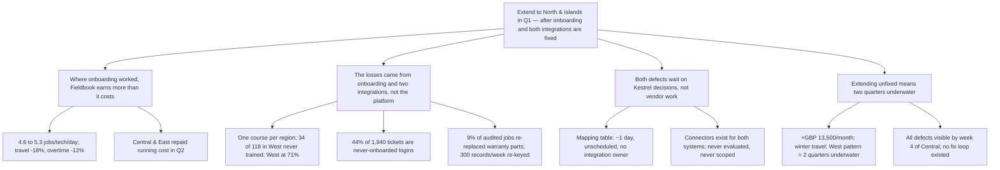

# Fieldbook rollout: recommendation on extending to North and Islands

Fieldbook has been live for two quarters in Central, East, South and West, and you asked for this review before the quarterly meeting. In that time the platform delivered the scheduling gains it was bought for — but only in the two regions where technicians were properly onboarded, and the program office has no mechanism to stop the same failures repeating in the next region. North and Islands are next, in winter, at £13,500 a month.

**Extend to North and Islands in Q1 — but commit the two go-live dates only after onboarding is restructured and the two known integrations are closed, because the extension is profitable at Central/East adoption pace and loss-making at West's.**

## 1. Where onboarding worked, Fieldbook earns more than it costs

- Completed jobs per technician per day rose from 4.6 to 5.3 across the four live regions; average travel time between jobs fell 18%.
- Emergency same-day insertion went from ring-around to automatic, median 4 minutes.
- Overtime in live regions is down 12% quarter over quarter and fuel per job down 9%.
- Against £31,000 a month in licence and hosting, Central and East repaid the running cost inside the second quarter. Both reached full adoption in six weeks.

## 2. What went wrong was onboarding and two integrations — not the platform

- The two-day classroom course ran once per region. In West, 34 of 118 technicians never attended any session; West is at 71% of orders in the system after nine weeks, South took eleven weeks to pass 80%.
- 44% of the 1,940 support tickets are password and login problems, concentrated in technicians who missed the course. The support desk lead: "We are doing the training program's job at ticket prices."
- Improvised shadowing cost an estimated 380 technician-hours of lost route time in South and West — which is why those two regions sit at break-even rather than in profit.
- Separately, two integration gaps drain the gain: no service-history feed from the legacy asset register means technicians work blind, and in 9% of audited jobs they replaced parts already replaced under warranty within the year. Mismatched completion codes force ~300 records a week to be re-keyed into invoicing, at £8,400 for one temporary clerk, plus a 2–4% weekly discrepancy that finance reconciles by hand.
- A third, smaller gap: exact-postcode-only customer search generates duplicate records, ~70 merged manually per week, splitting job history until merged.

## 3. Both defects are waiting on Kestrel decisions, so they can be closed before the next go-live

- The vendor has offered a configurable mapping table for the completion codes: roughly one day of setup. It is unscheduled because no one at Kestrel owns the integration.
- The vendor's catalogue lists supported connectors for both the asset register database and the invoicing import format. Neither has been evaluated. IT's view is that both are straightforward; no integration work was scoped into a program staffed for deployment and training only.
- The nightly asset-register export was requested in month two and is still in that team's backlog — a queue decision, not a technical obstacle.
- Vendor response times are within contract throughout. Nothing here is blocked on vendor work.

## 4. Extending without those fixes turns a profitable rollout into a two-quarter loss

- North and Islands add £13,500 a month in licence cost from day one.
- Winter travel makes a single classroom slot per region even harder to fill than it was in South and West — the exact condition that produced the West pattern.
- A repeat of West would leave both new regions underwater for at least two quarters, and would add their ticket load to a support desk already absorbing the training gap.
- Every negative pattern in this review was visible by week four of the Central go-live and replayed in each region afterwards, because the program had no route from field observation to program-level fix. Extending unchanged means buying that replay twice more.

## What must be true before the go-live dates are fixed

| Pre-condition | Owner | Test that it is met |
|---|---|---|
| Onboarding restructured: recurring sessions, joiner and absentee cover, no single-slot courses | [data needed: onboarding owner] | Every technician has a scheduled slot before go-live week |
| Integration ownership named for Fieldbook | [data needed: named owner, IT or program office] | One person accountable for both connectors |
| Completion-code mapping table configured | Vendor, ~1 day, once scheduled | Billing re-keying and the 2–4% reporting gap stop |
| Asset-register nightly export delivered | Asset register team — needs backlog priority from you | Equipment-history panel populated on job screens |
| Early-warning loop: week-four field review feeding program fixes | Program office | Issues found in North do not replay in Islands |

**What I need from you at the quarterly meeting:** approval in principle to extend in Q1, plus two decisions only you can make — priority for the asset-register export, and the named owner for integrations. Also worth deciding whether the exact-postcode search fix is scoped now or accepted as ongoing manual merging.

Two items in the review carry no decision: the unpopular parts-ordering screen (works correctly in testing; habit, not defect) and the general good health of the vendor relationship.

Structurally: the recommendation moved from the middle of section 4 to the first line, the six departmental sections were replaced by four reasons the COO can act on, and every mechanic (codes, feeds, search) now sits under the payoff or loss it drives rather than standing as a topic of its own.
